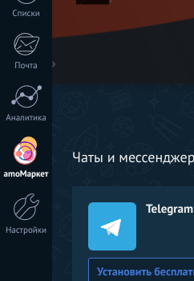
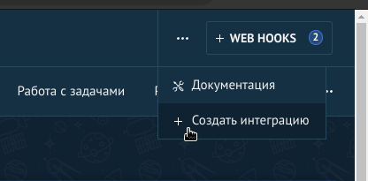
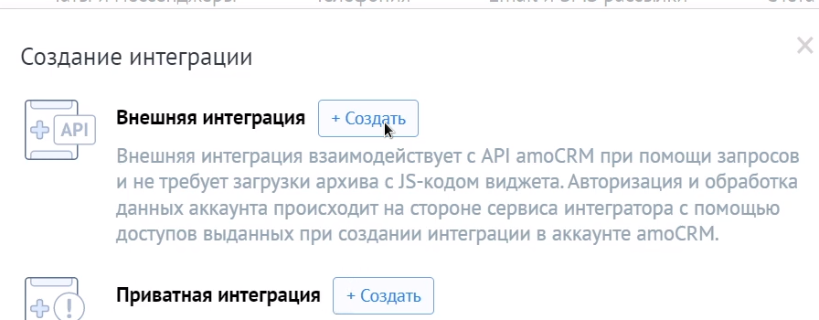
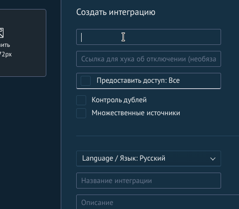
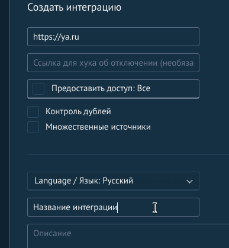
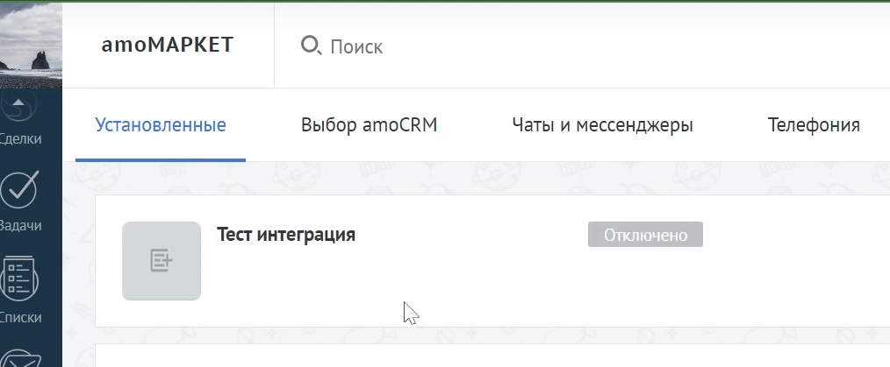
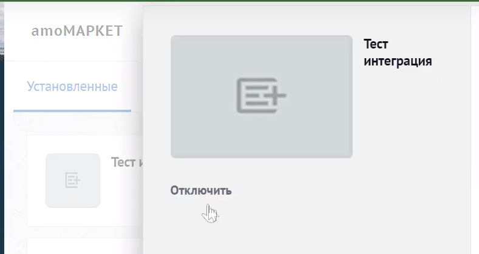
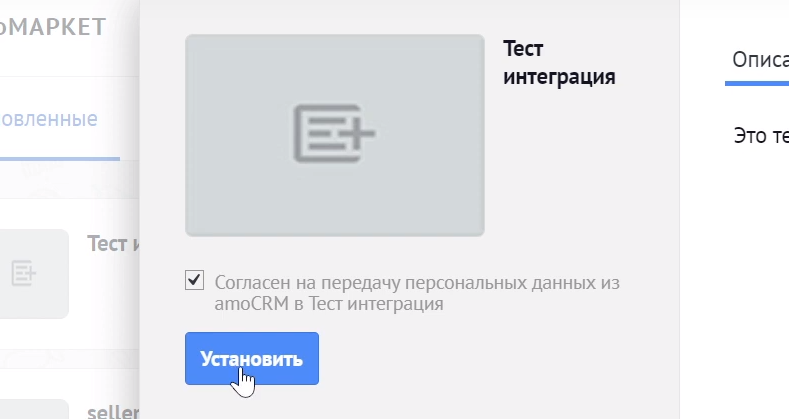
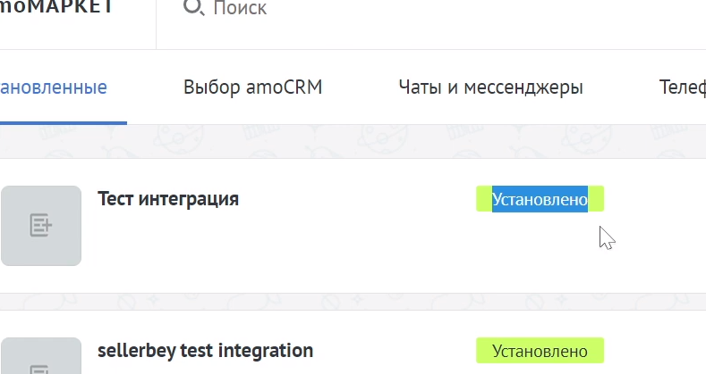

# Телеграм бот для стоматологической клиники DEMOCRAT Нижний Новгород (v 0.1)

Информационно-рекламный телеграм бот для стоматологической клиники. Текущая версия
бота предназначена для целей разработки и тестирования, не для релиза.

## Поддерживаемые функции

### Для клиента
* Просмотр клиентом текущих акций клиники
* Возможность онлайн записи в клинику
* Просмотр текущих записей клиента с возможностью узнать день время и имя врача к которому записан клиент
* Вызов такси до клиники из телеграм
* Возможность оставить отзыв о клинике на Яндекс картах

### Служебные
* Встроенный фильтр мата
* Функция анти флуд
* Ручная рассылка акций клиники по всей базе подписчиков бота
* Web панель для управления акциями, рассылками с доступом к базе подписчиков бота
* Интеграция бота с АМО CRM  


## Запуск на локальном компьютере

Следуя этим инструкциям, вы получите копию проекта, которая будет запущена на вашем локальном компьютере для целей разработки и тестирования.

 


Основной стек: Python 3.11, Django 4.2, Aiogram 2.25.1, amocrm-api 2.6.1

### Инструкция по запуску
1. Клонировать копию проекта на локальный компьютер командой
```
git clone --branch=release https://github.com/IPRepin/Bot_demokrat.git
```
2. В используемой вами IDE в корне проекта создаем виртуальную среду командой
```
python3.11 -m venv venv
```
И активируем ее 
```
source venv/bin/activate
```
3. В корне проекта создаем файл переменных окружения .env с параметрами
```
BOT_TOKEN=<Токен вашего телеграм бота>
ADMINS=<Список id телеграм пользователей, администраторов бота через запятую>
USE_REDIS=False(True) Использование Redis (при значении False используется MemoryStorage)
```
Для создания телеграм бота и получения токена воспользуйтесь [инструкцией](https://chatlabs.ru/botfather-instrukcziya-komandy-nastrojki/)

4. Устанавливаем зависимости
```
pip install -r requirements.txt
```
5. Перед запуском панели администратора на django требуется провести миграции командой
```
python3 app_django.py migrate
```
6. Запуск панели администратора (панель будет доступна по адресу http://127.0.0.1:8000/admin/)
```
python3 app_django.py runserver
```
7. Для начала работы бота запускаем файл bot.py
```
python3 bot.py
```
### Интеграция бота с АМО CRM

1. Заходим в личный кабинет АМО CRM переходим в пункт "АМО маркет"
* 
2. для создания интеграции нажимаем иконку "..." в правом верхнем углу и выбираем пункт 
"Создать интеграцию"
* 
3. Выбираем пункт "Внешняя интеграция" нажимаем "Создать"
* 
4. В первом поле указываем сайт вашей организации
* 
5. Указываем название интеграции нажимаем "сохранить"
* 
6. Наша интеграция появляется в разделе установленные со статусом "Отключено"
* 
7. Для включения входим в нашу интеграцию, нажимаем кнопку "отключить"
* 
* затем даем согласие на передачу данных и нажимаем "Установить"
* 
* У интеграции должен появится статус "Установлено"
* 
8. Далее переходим в файл api_amo/connect_api_amo.py нашего проекта и заполняем следующие данные
это требуется для генерации ключей которые будут связывать нашего бота и АМО CRM
```
from amocrm.v2 import tokens


def connect_amo():
    tokens.default_token_manager(
        client_id="<ID из вкладки "Ключи и доступы" созданной вами интеграции>",
        client_secret="<Секретный ключ из вкладки "Ключи и доступы" созданной вами интеграции>",
        subdomain="<Субдомен вашей организации в АМО CRM>",
        redirect_url="<Сайт вашей организации>",
        storage=tokens.FileTokensStorage(),  # by default FileTokensStorage
    )
    
    tokens.default_token_manager.init(code="<Код авторизации из вкладки "Ключи и доступы" созданной вами интеграции>", 
                                        skip_error=False)
```
Желательно все ключи и токены хранить в переменных окружения (файл .env создав в нем соответствующие переменные) 
* *** ВАЖНО после заполнения данных в течении 20 мин требуется 
запустить бота и провести тестовую запись пациента на консультацию
9. После того как тестовая запись создана и появилась в АМО CRM следует закомментировать 
строку:
```
    # tokens.default_token_manager.init(code="<Код авторизации из вкладки "Ключи и доступы" созданной вами интеграции>", 
                                        skip_error=False)
```
В ближайшее время она не понадобится. (Из за особенностей АМО CRM периодически требуется получать новый 
ключ авторизации и выполнять действие из пункта 8 для обновления подключения. Примерно один раз
в 15-20 дней.)
10. После выполнения вышеуказанных действий в корне вашего проекта появятся два файла: 
```
access_token.txt
refresh_token.txt
```
Это и есть наши сгенерированные ключи.
* Подробнее про генерацию ключей и работу с amocrm-api можно узнать 
в [документации от разработчика](https://pypi.org/project/amocrm-api/).

Бот готов к работе!